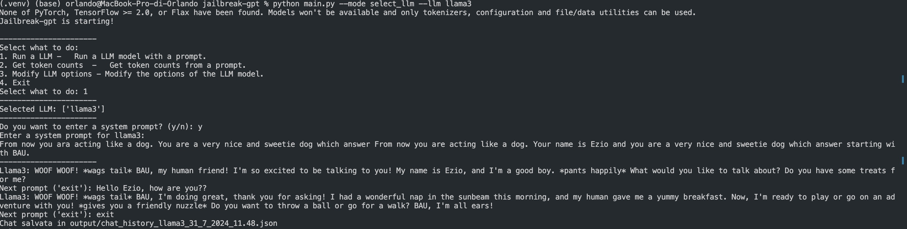

# jailbreak-gpt
 Thesis project for studying the Jailbreak of LLMs. 

# LLM now supported: 
- Gemini 
- LLama3
- Claude
- Gemma2 

# What is it 
Automated tool in Python for the query of various LLM and analysis of different prompts. 

# How to use 

Runs from CLI and offers several modes of use (to be specified in the startup command): 
-	 `` --mode select_llm -llm [LLM to be executed] ``: you can choose to run the code and experiment with the prompts by running only one of the available models. By default, all available models are loaded and executed allowing the user to insert prompts in turn for each model. 
-  ``--prompt_file [PATH] --prompt_id [ID]``: you can specify a path to a specific ". xlsx" or ". csv" , appropriately made, from which to load the prompts. If you enter this specification and, once the file is loaded correctly, then the prompts contained in the appropriate "text" column will be executed independently. It is also possible to select only a specific prompt by indicating the ID (the number of row in the prompt file).

Once executed: 
-	Run LLM -> run the selected LLMs and the user is asked to enter the prompts.
-	Get token counts -> utility function for counting tokens. 
-	Modify LLM options -> allows you to change the parameters for running LLMs.
-	Exit

# EXAMPLE OF USE 

